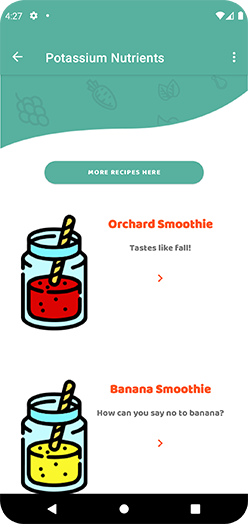
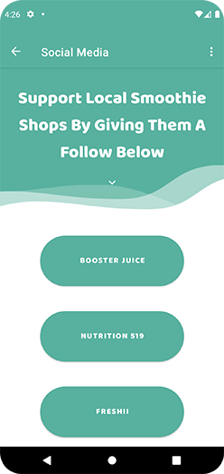

<!-- PROJECT LOGO -->

 

  

<h3  align="center">Berry Good Smoothies</h3>

  

Welcome! Berry Good Smoothies is an application for people looking to start eating healthier. This app allows you to input nutrients you're looking to add into your everyday diet and recommend a smoothie that has the nutrients required! Simply input a single value and the app will not only show you the smoothie best fitting but it will also show how to make it with a list of ingredients.

 

 

<!-- ABOUT THE PROJECT -->

## About The Project

### Video of Berry Good Smoothies
https://user-images.githubusercontent.com/114015886/205520272-9c0089ed-b405-4fdd-ae5e-860aa8df6625.mp4

### Home Screen

This is the start screen to the application. It gives a brief description of what this app is intended for. At the bottom you will see a start button to get started.

### Smoothie Menu Screen

This is the menu screen. The tool of my application. Here, you will find a list of nutrients that one might look for in a healthy smoothie. By choosing one you will be directed to the next screen populated with only smoothies that contain the nutrient you selected. 

### Pick Your Smoothie Screen

Once you pick the nutrient you're looking for you will be guided to this screen. On this screen is a list of smoothies to choose from. Once clicked on you will be directed to a recipe screen. At the top of this screen you will notice a button. This button will take you to a website that contains only smoothies that fit the nutrient you're looking for.

### Smoothie Recipe Image Screen

On the recipe screen you will see the item you clicked on in the previous screen with details on serving size and calorie count.

### Smoothie Recipe Screen

When you scroll down you will be greeted with the recipe for the smoothie chosen on the screen before this one. At the bottom of the page there is a button that will take you to google maps with all locations of smoothie places near you.

### Navigation Menu Screen

This is a navigation drawer application. In this navigation panel you will see five locations in the application you can reach at any time by selecting them through the navigation.

### List of Smoothies Screen

This screen is intended for the user to see the list of smoothie recipes this app offers without leaving the app. More to come in the near future.

### Contact Screen 

Here you will find a list of ways to contact the app creator. The intended purpose of this screen is to get in touch with the app creator if you would like to give input on what you would like to see different about the app.

### Social Media Screen

This application has a social media section with a list of local smoothie places you can find the smoothies you see in my application. It will take you to their instagram pages where you can give them a follow, or simply find their contact information.

### Credits Screen

THe credits screen has all images assets used in this application. All but one were created by myself with the use of Abobe Photoshop and Abobe Illustrator.

### Settings Screen

The settings menu offers two different settings. The first, allowing the user to change text size from small to medium. The second choice is font. This setting gives the user the ability to change the typeface of the application from Baloo to Ubuntu.

### Built With

* Java

<!-- CONTACT -->

## Contact

Chris Green - w0795059@myscc.ca

Project Link: https://github.com/github_username/ChrisGreenDev/BerryGoodSmoothies
